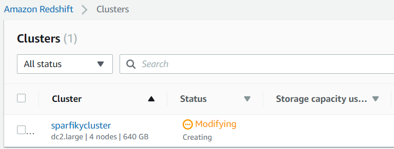

# Sparkify Analytics - Udacity Project 3

<p align="center">
  
</p>

On our last projects, we've helped Sparkify to implement an "on premise" environment, using SQL and NoSQL databases that support analytics team to build queries and get some insights about the business.

Now they want to migrate it for a fully managed environment on cloud and chose for Amazon Redshift, on AWS.

## Getting Started

We will help you to build a Redshift cluster, extract all needed data from S3 on AWS, import it on staging tables on Redshift and then, load all cleaned data to final tables on a star schema model.

## Prerequisites

You'll need to [create an AWS account](https://aws.amazon.com/pt/premiumsupport/knowledge-center/create-and-activate-aws-account/), to deploy you Redshift cluster.

*Atention: You should be charged for the services that you use, check the [AWS pricing](https://aws.amazon.com/pt/pricing/) in order to not be surprised while creating your environment.*

Also you need to [create an IAM user](https://docs.aws.amazon.com/directoryservice/latest/admin-guide/setting_up_create_iam_user.html) (use a name of your choice) and save its [access key and secret key](https://docs.aws.amazon.com/IAM/latest/UserGuide/id_credentials_access-keys.html) credentials (do not share it). Finally, you need to [atach the policy](https://docs.aws.amazon.com/IAM/latest/UserGuide/access_policies_manage-attach-detach.html) **AdministratorAccess** for this user.

## Dependencies

All of our scripts were written in python, you need to [install](https://www.python.org/downloads/) it.

We are going to work with **boto3**, that is the Amazon Web Service (AWS) SDK for python, if you are not familiar with, read this [documentation](https://boto3.amazonaws.com/v1/documentation/api/latest/index.html).

After install python, you should install all dependencies:

```
$ pip install boto3
$ pip install psycopg2
$ pip install configparser
```

## Datasets

You'll be working with two datasets that reside in S3, that was provided by Udacity:

* Song data: `s3://udacity-dend/song_data`
* Log Data: `s3://udacity-dend/log_data`

Log data json path: s3://udacity-dend/log_json_path.json

The star schema was created following the same structure of [Sparkify - Project 1](https://github.com/brunorochax/udacity_project1).

## Configuration File and Scripts 

* sparkify.cfg - Configuration file with credentials, cluster and file parameters.
* create_cluster.py - Script for Redshift cluster creation.
* create_tables.py - Script for create all needed tables.
* etl.py - Script for copy datasets from S3, import data to Redshift ant load final tables.
* delete_clusters.py - Script for Redshift cluster deletion.
* get_arn.py - Script for get cluster ARN on AWS.

For default, we've designed a dc2.large with 4 nodes on configuration file, you can change this setting if you feel comfortable.

## Running Scripts

For create the Redshift cluster, edit the file `sparkify.cfg` and set your access key and secret key:

```
[AWS]
KEY=put_your_key_here
SECRET=put_your_secret_here
```

Now you need to run the `create_cluster.py` script as follow:

```
$ python create_cluster.py
```

While you cluster is created, you should follow the status on Redshift dashboard, in your AWS console. Wait until the status change from "Modifying" to "Available".

<p align="center">
  
</p>

You should get two important properties of your cluster and set it on `sparkify.cfg`.

* Endpoint - An endpoint is the URL of the entry point for an AWS web service.
* ARN - A file naming convention used to identify a particular resource in AWS.

Run the `get_arn.py` script as follow:

```
$ python get_arn.py
```

Get the output and change your `sparkify.cfg` file again:

```
[CLUSTER]
DB_ENDPOINT=set_your_endpoint_here

...

[IAM_ROLE]
DB_ROLE_ARN=arn:set_your_arn_here

```

Now lets create our tables, run the script `create_tables.py`:

```
$ python create_tables.py
```

Wait for the message 'Tables were created.', then run the script `etl.py`:

```
$ python etl.py
```

You'll see all tables beeing loaded, wait for the message 'Tables have been loaded.'.

Sucess, now the analytics Sparkify team can work in a cloud environment!

## Authors

This project and data were created and provisioned by udacity.com on Data Engineering Nanodegree.